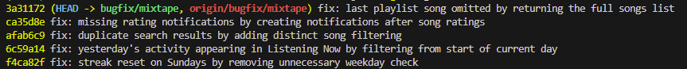

# AI 201 - Project 5

---

# AI Usage
I used ChatGPT as a code-reading and documentation assistant rather than asking it to find bugs automatically. 
- Example: After reading the code myself, I provided individual files and asked for help summarizing their responsibilities, tracing data flow, and identifying organizational patterns for the codebase map. This helped me organize what I had already learned from reading the project.

During debugging, I first traced each feature from the route layer into the corresponding service before asking ChatGPT to explain weird logic or verify my understanding of potential bugs. 
- Example: After following the listening streak code into `streak_service.py`, I asked ChatGPT to help explain what was wrong with the weekday comparison. I also used it to verify that duplicate search results could occur because of the SQL join in `search_service.py`.

Finally, I used ChatGPT to help write my codebase map by further explaining functions/methods that I didn't fully understand. I also had it help me during the root cause analysis entries by helping me figure out ways to reproduce the bugs.

# Bug Fix Commits



---

# Codebase Map

## app.py

### What it does
- Sets up the main Flask application
- Configures the application using environment variables (db URI, secret key, and SQLAlchemy settings)
- Initializes the db
- Registers all application bluebrints
- Creates the database tables automatically when the application starts

### Data Flow
1. User sends an HTTP request
2. Flask receives the request through the application created by create_app()
3. The request is routed to the correct Blueprint based on its URL prefix
4. That Blueprint calls the appropriate service layer
5. The service queries or updates the database
6. The result is returned as JSON back through Flask

### Pattern Noticed
- Uses the Application Factory pattern instead of creating a global Flask app.
- Every feature is isolated into a Blueprint, making routes modular.
- app.py never contains business logic—it only handles application configuration and wiring components together.


## models.py

### What it does
- Defines every databse model used by the application.
- Includes: 
    - User
    - Song
    - Playlist
    - Rating
    - ListeningEvent
    - Notifcation
    - Tag
- Defines three many-to-many association tables: Friendships, Song tags, and Playlist entries

### Data Flow
Creating a Playlist
1. playlist_service creates a Playlist model.
2. SQLAlchemy inserts it into the database.
3. Future requests retrieve the same model through relationships or queries.
4. When songs are added, playlist_entries stores the relationship and ordering information.

### Pattern Noticed
- Association tables are used to represent many-to-many relationships, including extra metadata such as playlist position and who added each song.
- UUIDs are used consistently as primary keys across all entities.


## routes/feed.py

### What it does
- Defines endpoints for the social feed.
- Provides: 
    - Friends currently listening (/listening-now)
    - Friends' listening history (/activity)
- Delegates all database work to feed_service.

### Data Flow
1. Client requests /feed/<user_id>/activity.
2. Route calls get_activity_feed().
3. Service retrieves the user's friends.
4. Service queries recent ListeningEvent records.
5. Service converts results into dictionaries.
6. Route returns JSON containing the feed and item count.

### Pattern Noticed
- Routes contain almost no logic
- Validation and HTTP responses stay in the route


## routes/playlists.py

### What it does
- Handles playlist-related API endpoints.
- Supports: 
    - Creating playlists
    - Viewing playlists
    - Listing playlist songs
    - Adding songs to playlists

### Data Flow
Adding a song to a playlist
1. Client sends POST request with song_id and added_by.
2. Route validates required fields.
3. Calls notification_service.add_to_playlist().
4. Service validates playlist, user, and song.
5. Song is added to the playlist.
6. If someone else originally shared the song, a notification is created.
7. Success response returned to client.

### Pattern noticed
- Routes only validate request bodies.
- One endpoint can trigger multiple backend actions (playlist update + notification).


## routes/songs.py

### What it does
- Handles all song-related endpoints.
- Supports: Searching songs, Retrieving song details, Rating songs, and Recording listening events

### Data Flow
Listening to a song
1. Client POSTs to /songs/<id>/listen.
2. Route validates user_id.
3. Calls record_listening_event().
4. Service creates a ListeningEvent.
5. Service updates the user's listening streak.
6. Database commits both changes.
7. Event is returned as JSON.

### Pattern Noticed
- Different features are separated into different services.
    - Search → search_service
    - Ratings → notification_service
    - Listening → streak_service
- Routes simply dispatch requests to the correct service.


## routes/users.py

### What it does
- Provides user-related endpoints.
- Supports:
    - User lookup
    - Viewing listening streak
    - Viewing notifications
    - Marking notifications as read

### Data Flow
Viewing notifications
1. Client requests /users/<id>/notifications.
2. Route checks optional unread_only query parameter.
3. Calls get_notifications().
4. Service queries the Notification table.
5. Notifications are sorted newest first.
6. JSON response is returned.

### Pattern noticed
- Mixes direct database lookups (user profile) with service-layer calls.
- Business operations (notifications and streaks) are delegated to services.


## services/feed_service.py

### What it does
- Generates both social feed endpoints.
- Retrieves friends' listening activity.
- Filters and formats feed results.

### Data flow
Friends Listening Now
1. Load the current user.
2. Collect friend IDs.
3. Query recent ListeningEvents.
4. Remove duplicate friends so only the newest event remains.
5. Fetch corresponding User and Song records.
6. Return formatted feed objects.

### Pattern noticed
- Service performs all querying and filtering.
- Routes never interact directly with database models.


## services/notification_service.py

### What it does
- Handles notifications and ratings.
- Creates notifications.
- Retrieves notifications.
- Marks notifications as read.
- Adds songs to playlists.
- Records song ratings.

### Data flow
Adding a song to a playlist
1. Validate song.
2. Validate user.
3. Validate playlist.
4. Add song if it isn't already present.
5. Commit playlist update.
6. If the adder isn't the original sharer:
    - Create a notification.
    - Save notification.
7. Finish request.

### Pattern noticed
- One service manages related social interactions.
- Helper function create_notification avoids duplicate notification code.


## services/playlist_service.py

### What it does
- Contains playlist business logic.
- Creates playlists.
- Retrieves playlists.
- Retrieves ordered playlist songs.
- Retrieves playlists owned by a user.

### Data flow
Getting playlist songs
1. Validate playlist exists
2. Join Song with playlist_entries
3. Sort by playlist position
4. Convert each song to a dictionary
5. Return ordered list

### Pattern noticed
- Uses SQL joins rather than relationship iteration to preserve playlist order.
- Keeps playlist retrieval separate from notification logic.


## services/search_service.py

### What it does
- Implements song searching.
- Retrieves individual songs.

### Data flow
Song search
1. Receive search string.
2. Query songs matching title or artist.
3. Join tag relationships.
4. Convert each result to a dictionary.
5. Return results list.

### Pattern noticed
- Pure read-only service.
- Uses SQLAlchemy query building instead of manual filtering.


## services/streak_service.py

### What it does
- Tracks listening history.
- Updates listening streaks.
- Retrieves streak values.

### Data flow
Recording a listening event
1. Validate user
2. Create a ListeningEvent
3. Call update_listening_streak()
4. Compare today's date with last listening date
5. Increment, preserve, or reset streak
6. Commit changes
7. Return event

### Pattern noticed
- Complex streak rules are isolated into a helper function.
- One database transaction updates both the event and the user's streak.

---

# Root Cause Analysis

## Issue #1: My listening streak keeps resetting

### How I reproduced it
1. Create a user with an existing listening streak.
2. Set `last_listened_at` to the previous day.
3. Record a new listening event on a Sunday.
4. Observe that the streak resets to 1 instead of incrementing.

### How I found the root cause
- Started from `routes/songs.py` (`/listen` endpoint).
- Followed the call to `record_listening_event()` in `services/streak_service.py`.
- Traced into `update_listening_streak()`.
- Found the conditional responsible for incrementing the streak.

### The root cause
The streak increment logic contains an unnecessary weekday check:

```python
elif days_since_last == 1 and today.weekday() != 6:
    user.listening_streak += 1
```

`today.weekday() == 6` represents Sunday. This condition prevents streaks from incrementing on Sundays, causing the streak to reset even when the user listened on consecutive days.

### My fix and side-effect check
Remove the weekday restriction:

```python
elif days_since_last == 1:
```

This allows streaks to increment after any consecutive day.

Checked:
- Same-day listens still do not increment twice.
- Missing more than one day still resets the streak.
- Consecutive listening works for every day of the week.


## Issue #2: Friends Listening Now shows people from yesterday

### How I reproduced it
1. Create a listening event late yesterday (less than 24 hours ago).
2. Request `/feed/<user_id>/listening-now`.
3. Observe that the friend still appears in the feed.

### How I found the root cause
- Started from `routes/feed.py`.
- Followed the call to `get_friends_listening_now()` in `services/feed_service.py`.
- Found the time filter used to determine "recent."

### The root cause
The service defines "Listening Now" as anything within the past 24 hours:

```python
RECENT_THRESHOLD = timedelta(hours=24)
```

and filters using

```python
ListeningEvent.listened_at >= cutoff
```

Due to this, listening events still appear from the previous day.

### My fix and side-effect check
Replace the rolling 24-hour cutoff with the beginning of the current day (midnight UTC):

```python
today = datetime.now(timezone.utc).date()
cutoff = datetime.combine(today, datetime.min.time(), tzinfo=timezone.utc)
```

Checked:
- Today's listening events still appear.
- Events from previous calendar days no longer appear.


## Issue #3: The same song keeps showing up twice in search

### How I reproduced it
1. Create a song with multiple tags.
2. Search using the song's title or artist.
3. Observe that the same song appears multiple times in the results.

### How I found the root cause
- Started from `routes/songs.py`.
- Followed the search request to `search_service.py`.
- Examined the SQLAlchemy query joining the `song_tags` table.

### The root cause
The search query performs an outer join with the `song_tags` table:

```python
.outerjoin(song_tags, Song.id == song_tags.c.song_id)
```

A song with multiple tags produces multiple joined rows, but the query never removes duplicate songs before returning them.

### My fix and side-effect check
Add `.distinct()` to the query:

```python
db.session.query(Song)
.outerjoin(song_tags, Song.id == song_tags.c.song_id)
.filter(
    db.or_(
        Song.title.ilike(f"%{query}%"),
        Song.artist.ilike(f"%{query}%"),
    )
)
.distinct()
.all()
```

Checked:
- Songs with multiple tags appear once.
- Songs without tags still appear.
- Search by title and artist continues to work.


## Issue #4: I got notified when a friend added my song to a playlist but not when they rated it

### How I reproduced it
1. Have User A share a song.
2. Have User B rate the song.
3. Check User A's notifications.
4. No notification is created.

### How I found the root cause
- Started from `routes/songs.py`.
- Followed the `/rate` endpoint into `notification_service.py`.
- Compared `rate_song()` with `add_to_playlist()`.

### The root cause
`add_to_playlist()` creates a notification after updating the playlist:

```python
create_notification(...)
```

However, `rate_song()` only creates or updates the rating and commits it:

```python
db.session.commit()
```

There is no call to `create_notification()`, so the original song sharer is never notified.

### My fix and side-effect check
After committing the rating, create a notification for the song's original sharer when the rater is someone else:

```python
if song.shared_by != user_id:
    create_notification(
        user_id=song.shared_by,
        notification_type="song_rated",
        body=f"{rater.username} rated your song '{song.title}' {score}/5.",
    )
```

Checked:
- Ratings continue to save correctly.
- Users are not notified about their own ratings.
- Playlist notifications continue working.


## Issue #5: The last song in a playlist never shows up

### How I reproduced it
1. Create a playlist containing multiple songs.
2. Request `/playlists/<id>/songs`.
3. Observe that the final song is always missing.

### How I found the root cause
- Started from `routes/playlists.py`.
- Followed the request to `get_playlist_songs()` in `playlist_service.py`.
- Examined the returned list.

### The root cause
The function returns

```python
return [song.to_dict() for song in songs[:-1]]
```

The slice `[:-1]` removes the final element of the list every time, causing the last playlist song to never be returned.

### My fix and side-effect check
Return the complete list instead:

```python
return [song.to_dict() for song in songs]
```

Checked:
- All playlist songs are returned.
- Playlist ordering is preserved.
- Single-song playlists now correctly return one song.